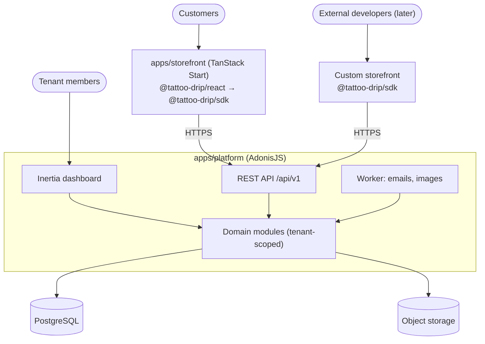

# Architecture

A **modular monolith**: one AdonisJS app owns the data, the business rules and the API, and runs as a web process plus a worker. The dashboard (Inertia + React) lives inside it. The storefront is a separate TanStack Start app that talks to the platform only through the API. There are no microservices.



## Monorepo

The monorepo uses pnpm workspaces, with Biome for formatting and linting.

```text
apps/platform      AdonisJS 7 + Inertia + React: dashboard, REST API, worker
apps/storefront    TanStack Start: hosted storefront
packages/types     @tattoo-drip/types: openapi.yaml + generated types
packages/sdk       @tattoo-drip/sdk: framework-independent API client
packages/react     @tattoo-drip/react: TanStack Query hooks
```

- The storefront never imports from `apps/platform`, and `packages/*` never import from `apps/*`.
- Packages are consumed from source inside the workspace.
- A `packages/ui` package is added when the first component is actually shared.

## Backend modules

Each module owns its models and services. Other modules call its services instead of querying its tables. Inertia controllers, API controllers and jobs stay thin and call the **same** services, so every rule lives in one place.

| Module | Owns |
|---|---|
| Identity | Users, auth, email verification |
| Tenancy | Tenants, memberships, invites, roles, tenant context |
| Artists | Artist profiles, artist ↔ service mapping |
| Portfolio | Projects, images |
| Catalog | Services, style and placement lists |
| Scheduling | Availability, exceptions, slots, appointments |
| Bookings | Requests, status changes, customers, reference images |
| Notifications | Transactional emails |
| Storefront | Storefront configuration, themes |

## Tenant context

The tenant is always in the URL.

| Entry point | Tenant comes from | Checked |
|---|---|---|
| Dashboard | `/t/blackneedle/bookings` | Membership and role, on every request |
| REST API | `/api/v1/tenants/blackneedle/…` | The tenant exists (old slugs resolve as aliases) |

The URL works better than a session or a header:
- Tabs open on different tenants each act on the tenant on screen.
- A path works for any client on any domain.
- The URL is a correct CDN cache key.

The hosted storefront maps its subdomain to the slug.

Isolation has several layers:

1. Middleware resolves the tenant and checks the membership.
2. Services scope every query by tenant. Never trust a tenant ID sent in a request body.
3. **PostgreSQL row-level security** on tenant-owned tables. The app connects as a role that doesn't own the tables, and sets the tenant per transaction with `SET LOCAL`. If no tenant is set, queries return no rows.
4. Composite foreign keys block links between tenants (see [data-model](data-model.md)).
5. Every tenant-owned endpoint has a test proving that tenant A can't reach tenant B's data.

## Domains, sessions, auth

- Storefronts run on `{slug}.platform.com`. The dashboard (`app.`) and the API (`api.`) run on a **separate** registrable domain, so tenant subdomains can never read or set dashboard cookies.
- The dashboard session cookie is host-only (`__Host-`), `HttpOnly`, `Secure` and `SameSite=Lax`, with CSRF protection on.
- The public API is stateless and cookieless. CORS is open on its public endpoints, without credentials.
- Auth uses AdonisJS's session guard: email and password, email verification, password reset and rate-limited login.

## Request flows

**Guest booking**
1. The storefront maps `blackneedle.platform.com` to the `blackneedle` slug and loads data through the SDK.
2. The browser sends the booking, images and bot-challenge token **directly to the API** as one multipart request. Going direct avoids storefront body-size limits, lets rate limits see the real IP, and leaves no orphaned uploads.
3. The API checks the challenge and limits and processes the images. The Bookings module checks that the artist, service and slot are valid for the tenant and saves the booking as `requested`.
4. The worker sends emails to the customer and to the tenant.

**Dashboard action**
1. "Approve & confirm" runs auth, tenant and role middleware.
2. The Bookings service sets the status, and Scheduling creates the appointment in the same transaction. The no-overlap constraint settles any race.
3. Inertia returns new props, and a job emails the customer.

## Files, scale, hosting

- **Uploads** always go through the API. Images are re-encoded, which strips EXIF data and GPS location, converts HEIC and rejects disguised files. The worker resizes them.
- **Image visibility:** portfolio images are public behind a CDN. Reference images are private and served through short-lived signed URLs, issued only after a membership check.
- **Caching:** public reads and storefront pages use short `Cache-Control` TTLs with `stale-while-revalidate` behind a CDN. Slots have the shortest TTL.
- **Rate limits** apply per IP and per tenant. The storefront's server-side rendering calls the API with a secret **server key**. The key only stops the storefront server from counting as one client, and grants no extra data.
- **Jobs** use a PostgreSQL-backed queue in V1, with no Redis. Every job carries its tenant.
- **Email** is sent from the platform domain, with SPF, DKIM and DMARC set up. It is never sent from a tenant's domain.

| Part | Where |
|---|---|
| Storefront | Vercel, root directory `apps/storefront`, wildcard domain |
| Platform web + worker | Containers on a managed host, in the same region as the database |
| PostgreSQL | Managed, with backups and point-in-time recovery |
| Files | Cloudflare R2 (S3 API, no egress fees) + CDN |

## Storefront themes

Themes are React components in the storefront. Tenants never store markup or scripts. Their `StorefrontConfiguration` picks a theme and fills in its options.

## Current state

- **`apps/platform`** is the AdonisJS 7 React starter, switched to PostgreSQL. It has session auth with signup, login and dashboard pages. The users migration has not been run yet.
- **`apps/storefront`** is the single-artist prototype, moved unchanged. It still uses mock data and still contains Prisma, better-auth and Supabase. Those get removed once the API exists.
- **`packages/*`** hold a working SDK against a draft `openapi.yaml`. The API endpoints themselves are not built yet.
