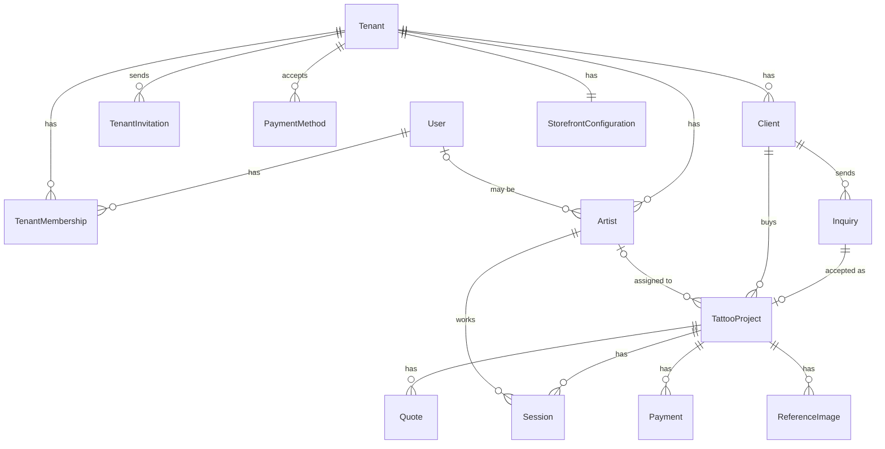

# Data model

This is conceptual: no columns or migrations, only the important fields. The model sells **projects**, not slots. An **Inquiry** becomes a **TattooProject**, which carries the quote, payments and sessions.



Every entity except `User` belongs to a `Tenant`; most of those lines are left out of the diagram.

## Tenant ownership

- `User` is global, and the style and placement lists (V1) are platform data. **Every other entity is tenant-owned** and stores its tenant directly.
- References between tenant-owned rows include the tenant (composite foreign keys), so the database rejects cross-tenant links.
- Users have no `tenant_id`; access is the set of a user's `TenantMembership` rows.
- **Conventions:**
  - Primary keys are UUIDv7.
  - Instants are stored in UTC.
  - Phone numbers are normalized to E.164, defaulting to +977.
  - Money is an integer in minor units (paisa) with a currency, `NPR` by default.

## MVP entities

| Entity | Responsibility |
|---|---|
| **User** | A person who can log in, with a verified email |
| **Tenant** | A `studio` or `independent` business: name, slug (old slugs kept as aliases), profile (contact phone and email, address, social links), timezone, default deposit percentage, deposit policy text |
| **TenantMembership** | One role (`owner` or `artist`) for one user in one tenant |
| **TenantInvitation** | Email, role, an optional artist profile to claim, and a hashed single-use token that expires after 7 days |
| **Artist** | A public profile in one tenant (name, slug, bio, photo, visible, accepting inquiries plus a message), optionally linked to a `User` |
| **PaymentMethod** | A way the studio gets paid: kind (`fonepay`, `esewa`, `khalti`, `bank`, `cash`), a label, and a QR image or account details |
| **Client** | A person who contacts the studio: one per normalized phone per tenant; name, optional email, notes. Form input never overwrites an existing client |
| **Inquiry** | The first contact, exactly as submitted: idea, placement, approximate size, preferred dates, preferred artist, budget, source channel, contact snapshot. Status `new`, `accepted` or `declined` |
| **TattooProject** | The sale: client, artist, brief, status (see [project rules](requirements.md#project-rules)), last-contacted time, notes. Created when an inquiry is accepted, or directly for a walk-in |
| **Quote** | Fixed price, or hourly rate with estimated hours; deposit amount (may be zero); expiry. A new version replaces the current one, and history is kept |
| **Payment** | Kind (`deposit`, `session`, `balance`, `refund`), amount, method, proof image, status (`submitted`, `verified`, `rejected`), who verified it and when. Never edited or deleted; a refund is a negative payment |
| **Session** | A time block for one artist inside a project: kind (`consultation`, `tattoo`, `touch_up`), start and end, status (`scheduled`, `completed`, `no_show`, `cancelled`). The database prevents overlapping active sessions for the same artist |
| **ReferenceImage** | An image from the client, attached to the inquiry and then to its project. Private |
| **StorefrontConfiguration** | One per tenant. In the MVP: which artists show and the intro text. Theme and branding come in V1 |

- **Balance due** = the current quote's total (or hours × rate) − verified payments. It is computed, never stored.
- **Inquiry vs project:** the inquiry is an immutable record of what was asked; the project is what the studio manages. Declined inquiries never become projects.
- **One person in two studios:** one `User`, two memberships and two `Artist` profiles. Clients and projects never cross tenants.

## V1 entities

| Entity | Responsibility |
|---|---|
| **Service** | A fixed-price offering (piercing, flash size, consultation) with duration; artist ↔ service mapping |
| **Flash** | A pre-drawn design: image, price, size, one-off or repeatable. Booking one creates a project with a fixed quote |
| **ArtistAvailability**, **AvailabilityException** | Weekly hours and dated overrides (time off, extra hours, studio-wide closures), used for instant booking |
| **PortfolioItem** | Finished work, optionally linked to its project, shown on the studio site |
| **TattooStyle**, **BodyPlacement** | Platform-wide lists with stable slugs |
| **GatewayPayment** | A Khalti or Fonepay transaction behind an automatically confirmed `Payment` |

In V1, bookable slots are computed, never stored:

```text
weekly availability ± exceptions − active sessions
within [now + minimum notice, now + horizon], split by service duration
```

Consent records, commissions and payouts, and locations are V2. They wait for interviews and legal review.
