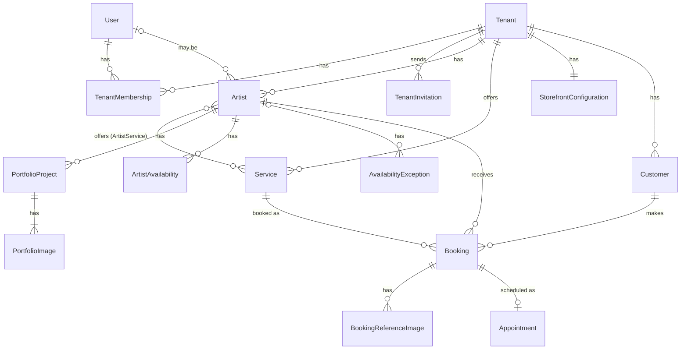

# Data model

This is conceptual: no columns or migrations, only the important fields.



## Tenant ownership

- `User` is global, and the style and placement lists are platform data. **Every other entity is tenant-owned** and stores its tenant directly, even when the tenant could be derived from a parent.
- References between tenant-owned rows include the tenant (composite foreign keys), so the database rejects cross-tenant links.
- Users have no `tenant_id`. Access is the set of a user's `TenantMembership` rows.
- Primary keys are **UUIDv7**: not guessable, sortable by time.
- Instants are stored in UTC. Weekly availability is stored as local times plus the tenant's timezone, so it stays correct across daylight-saving changes.

## Entities

| Entity | Responsibility |
|---|---|
| **User** | Person who can log in. Verified email. |
| **Tenant** | `studio` or `independent`. Holds the name, slug (old slugs kept as aliases), profile (description, contact email, phone, address, social links), IANA timezone and booking settings. Billing will attach here, never to a user. |
| **TenantMembership** | One role (`owner` or `artist`) for one user in one tenant |
| **TenantInvitation** | Email, role, an optional artist profile to claim, and a hashed single-use token that expires after 7 days |
| **Artist** | Public profile in one tenant: name, slug, bio, photo, visible flag, and accepting-requests flag with a message. Optionally linked to a `User`. |
| **ArtistService** | Which artists offer which services |
| **Service** | Name, description, estimated duration, optional starting price |
| **PortfolioProject** | One piece: title, description, one style, one placement, date |
| **PortfolioImage** | Ordered image of a project |
| **TattooStyle, BodyPlacement** | Platform-wide lists with stable slugs, exposed through the API |
| **ArtistAvailability** | Weekday plus start and end time |
| **AvailabilityException** | Dated override. With an artist: time off, a blocked date or extra hours. With no artist: a studio-wide closure. |
| **Customer** | One record per normalized email per tenant. Created on first booking, edited only by members, never shared across tenants, no login. |
| **Booking** | The request and its **status**: customer, source (`storefront` or `dashboard`), contact details as submitted, service, artist, tattoo details (idea, style, placement, size, budget), requested time, notes |
| **BookingReferenceImage** | Private image uploaded with a booking |
| **Appointment** | The confirmed **time** (artist, start, end). It has no status of its own. When a booking is cancelled, its appointment stops blocking time but is kept for history. |
| **StorefrontConfiguration** | One per tenant: theme, branding and sections, stored as structured config (below) |

- **One person in two studios:** one `User`, two memberships and two `Artist` profiles. Portfolios aren't shared across tenants.
- **An independent artist** is an `independent` tenant whose owner holds its only `Artist` profile.
- **Booking vs Appointment:** Booking holds the status and Appointment holds the time. This leaves room for multi-session pieces later. V1 has one appointment per booking.
- **No double booking:** a database exclusion constraint prevents overlapping active appointments for the same artist.
- **Unverified input:** a booking's contact details are a snapshot, and form input never overwrites the `Customer` record.

Available slots are computed and never stored:

```text
weekly availability ± exceptions − active appointments
within [now + minimum notice, now + horizon], split by service duration
```

The booking status lifecycle is in [requirements](requirements.md#booking-rules).

## Storefront configuration

```json
{
  "theme": "classic",
  "branding": { "logo": "…", "colors": { "primary": "#111111" }, "font": "…" },
  "sections": [{ "type": "hero", "props": {} }, { "type": "portfolio", "props": {} }]
}
```

In V1, `sections` only toggles and orders the sections a theme supports. The future page builder extends the same structure. It never stores HTML or scripts.
