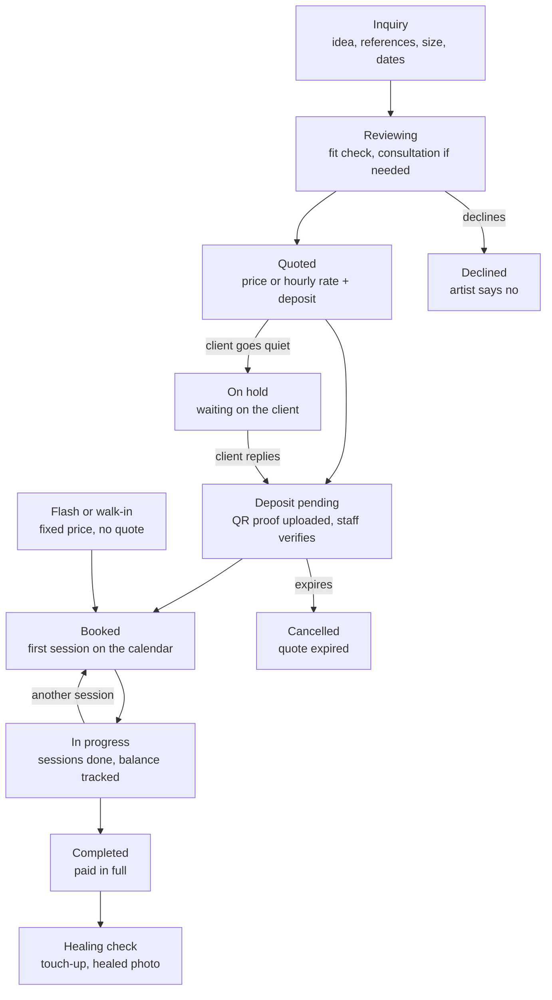

# Tattoo Drip: Market Research & Product Strategy

> A snapshot of the [Claude Doc](https://claude.ai/code/artifact/aa122abc-254a-4204-a5eb-0b4aaa463cab) from 3 October 2026, kept next to the code as the evidence behind [product](product.md), [requirements](requirements.md) and the [roadmap](roadmap.md). Where they differ, those docs hold the decision. Actions 5 and 6 in section 15 are done.

## 1. Executive summary

Build the Nepal-ready path from inquiry to deposit first. The storefront, page builder and public SDK are later bets, not the wedge.

- **Nepali studios work request-first.** All 7 studio sites we checked confirm bookings by hand, none publish prices, and 5 send customers to WhatsApp. Deposits happen outside any system.
- **The tattoo workflow itself is not new.** InkDesk, Venue, InkLinka and InkQuarters already run inquiry → quote → deposit → multi-session projects. Tattoo Studio Pro already sells websites with custom domains.
- **But none of them can take a deposit in Nepal.** Their deposits run on Stripe, which doesn't operate in Nepal, Sri Lanka, Bangladesh or Pakistan. Nepal runs on Fonepay QR (2+ million merchants), eSewa and Khalti.
- **The local competition is generic.** NEXSalon markets tattoo support with eSewa and Fonepay, though we couldn't verify it. Fresha's pricing page shows NPR 830 a month, which sets the price anchor.
- **The wedge:** intake link → inquiry inbox → quote → deposit with QR proof → sessions, on phones, with no paid integrations. Automatic payment confirmation comes in V1.
- **What to drop for now:** the page builder, the public SDK and developer portal, the marketplace, and WhatsApp or Instagram API inboxes. tattoo.dev already offers a headless tattoo API in beta, and demand for custom studio sites is small.
- **The biggest risk is commercial.** Studios may keep everything in chat, and Nepal alone is too small. Treat Nepal as the lab, then expand to other Stripe-less markets.
- **Next:** 12 owner interviews, a NEXSalon demo and a 5-studio concierge pilot, before more platform work.

## 2. Nepal tattoo market

Every Nepali studio we checked works request-first: the customer sends an idea, the studio replies, and the slot is confirmed by hand. None publishes prices, and only one publishes a deposit rule.

### How seven studios take bookings (verified on their own sites)

| Studio | Area | How a customer books | Deposit (as published) |
| --- | --- | --- | --- |
| [Tattoo Workshop](https://tattooworkshopnepal.com/) | Kathmandu | Web form (name, email, phone, tattoo idea) that sends a request, or WhatsApp; free consultation | Not stated |
| [Tattoo Pasal](https://tattoopasal.com/) | Thamel | WhatsApp or Instagram DM to "book a free consultation"; sessions "continue as needed until the work is completed" | Not stated |
| [Mystic Ink Nepal](https://www.mysticinknepal.com/) | Thamel | Contact page, WhatsApp, email; has a guest-artist page, piercing and a shop | Not stated |
| [AL.Ink Studio](https://www.alinkstudio.com.np/bookings) | Ranibari | Custom form with preferred date, time, style and a "Deposit" field; still a request | Field exists, terms not stated |
| [Traditional Tattoo Nepal](https://traditionaltattoonepal.com/) | Patan | FAQ: contact by Instagram, phone or web, share idea, placement and date, "pay the deposit (if required)" | If required |
| [Freak Street Tattoo](https://freak-street-tattoo.reservio.com/) | Kathmandu | Reservio booking page listing 4 artists | Not shown |
| [Himalayan Ink](https://www.himalayanink.com/) | Pokhara | Email or phone; prices "only during personal talks"; per hour for multi-session work | 25%, non-refundable; appointment confirmed only after it; changes need 48 hours' notice |

### What this tells us

- **Verified:** 7 of 7 are request-based. 0 of 7 publish prices. 5 of 7 push customers to WhatsApp. One (Freak Street) uses Reservio, a generic booking tool.
- **Verified:** Stripe, which international tattoo tools use for deposits, does not operate in Nepal ([Stripe country list](https://stripe.com/global)). Those tools' deposit features simply don't work for a Nepali studio.
- **Verified:** Fonepay QR is everywhere: more than 2 million merchants ([ShareSansar, Aug 2026](https://www.sharesansar.com/index.php/newsdetail/fonepay-credit-card-crosses-50000-users-with-support-from-nine-partner-banks-2026-08-12)) and over 1 million QR payments in one day in March 2025 ([ShareSansar](https://www.sharesansar.com/newsdetail/fonepay-sets-record-with-over-1-million-qr-transactions-in-a-single-day-2025-04-03)).
- **Observed pattern (inference):** deposits are most likely paid by QR or bank transfer, and "proof" is a payment screenshot sent in chat. No studio site shows an online payment step.
- **Unknown:** what studios use internally (paper diary, Google Calendar, spreadsheets, NEXSalon), how quotes are given, and how artists are paid. Only interviews can answer this.

### Market size and channels

- **Studios:** a travel blog counts 50+ studios in Kathmandu, 32 of them in Thamel, with prices of NPR 1,500 to 7,000 for small pieces, up to NPR 50,000 for large ones, and NPR 1,500 to 3,000 an hour ([Amazing Nepal Trek](https://www.amazingnepaltrek.com/blog/tattoo-tourism-why-nepal-is-the-next-big-spot-for-ink-lovers)). Treat these as rough, unaudited figures.
- **Customers online:** 16.6 million internet users (56%), 14.8 million on Facebook, 11.0 million on Messenger, 4.35 million on Instagram, as of late 2025 ([DataReportal](https://datareportal.com/reports/digital-2026-nepal)). Viber has 10+ million Nepali users ([Nepali Telecom](https://www.nepalitelecom.com/top-messaging-apps-in-nepal)).
- **Tourism matters:** Thamel, Freak Street and Pokhara Lakeside serve foreign walk-ins. The International Nepal Tattoo Convention has run since 2011, and Pokhara's Nepalinked festival is invite-only.
- **Platform risk is real:** in September 2025 the government blocked 26 unregistered platforms, including Facebook, Instagram and WhatsApp. The ban was lifted on 10 September after deadly protests ([The Record](https://therecord.media/nepal-social-media-ban-lifted-after-deadly-protests)). Viber stayed up and became the most downloaded app ([Nepali Telecom](https://www.nepalitelecom.com/2025/09/viber-becomes-most-download-app-in-nepal-after-social-media-ban.html)). A studio whose whole booking history lives in Instagram DMs lost access overnight.

## 3. Customer pain points

The strongest pains sit between first message and paid deposit: details scattered across chat apps, deposits that can't be taken or tracked online in Nepal, and quotes that only happen in conversation. Rows are ranked by evidence first, then severity.

| # | Pain | Evidence | Who feels it | Severity | Frequency |
| --- | --- | --- | --- | --- | --- |
| 1 | Inquiry details (idea, references, placement, size, dates) are scattered across WhatsApp, Instagram, Viber, phone and email | **Verified** channel mix: 5 of 7 studios route bookings to WhatsApp; the rest use DMs, email or phone. **Hypothesis**: the mess is painful (vendor marketing says so; not yet heard from a Nepali owner) | Every studio; worst for busy custom artists | High | Daily |
| 2 | Deposits can't be taken or tracked online | **Verified**: Stripe isn't available in Nepal; 3 of 7 studios mention deposits; Himalayan Ink confirms only after a 25% deposit. **Inference**: paid by QR, proven by screenshot, matched by hand | Studios taking custom work | High | Every booking |
| 3 | Reserved custom slots lost to no-shows and late cancellations | **Observed**: deposit and 48-hour rules exist (Himalayan Ink, [industry norm](https://useapprentice.com/blog/tattoo-deposit-policies-how-much-to-charge-and-why)). Vendor no-show statistics are marketing, not evidence | Custom and large-piece artists | High per event | Weekly (unverified) |
| 4 | Quoting is slow and personal | **Verified**: 0 of 7 publish prices; Himalayan Ink: "We do not discuss prices over email". **Hypothesis**: customers drift away while waiting for a quote | Studios and customers | Medium | Every custom inquiry |
| 5 | Multi-session pieces are tracked by memory | **Verified**: Tattoo Pasal sessions "continue as needed"; Himalayan Ink prices multi-session work per hour. **Unknown**: how sessions, hours and balances are recorded | Sleeve and back-piece artists | Medium | Weekly |
| 6 | Websites are stale and disconnected from bookings | **Verified**: sites run on Blogger (Mystic Ink), WordPress with Elementor (Tattoo Pasal) and a custom Next.js build (AL.Ink); Mohan's site is a banner; every web form ends in an email or chat | Studio owners | Medium | Continuous |
| 7 | Customer history lives inside platforms the studio doesn't control | **Verified**: the September 2025 ban cut off Facebook, Instagram and WhatsApp for days | All studios | Severe when it hits | Rare |
| 8 | Guest artists, piercing and tourists add scheduling and payment edge cases | **Verified**: Mystic Ink runs a guest-artist page; 4 of 7 also pierce; tourist areas dominate. **Unknown**: how much this hurts | Thamel and Pokhara studios | Low to medium | Seasonal |

Consent and medical declarations are not ranked. We found no national tattoo regulation for Nepal; Tattoo Pasal requires age 18+ and medical clearance for diabetes. This needs Nepal-specific legal review before any product decision.

## 4. Competitive landscape

Abroad, the tattoo workflow is already solved and crowded. In Nepal, the tattoo workflow is unsolved because the tools that solve it can't take local payments.

- **International tattoo tools** already do request → review → quote → deposit → multi-session project: InkDesk, Venue, InkLinka and InkQuarters all ship it. A `TattooProject` is table stakes there, not a differentiator.
- **Websites are table stakes too.** Tattoo Studio Pro includes hosting in every plan and sells it alone for $10 a month with a custom domain ([TSP hosting](https://tattoostudiopro.com/websites/hosting/)).
- **Their deposits run on Stripe**, which doesn't operate in Nepal. A Nepali studio can't use their core money feature.
- **The local option is generic.** NEXSalon markets tattoo support with eSewa and Fonepay (your team's finding). Its site timed out for us on 3 October 2026, so none of it is verified. Fresha's pricing page showed **NPR 830 a month**, or NPR 550 per team member, which is the price anchor any Nepal plan will be compared with.
- **The headless idea already exists.** [tattoo.dev / TattooAPI](https://tattoo.dev/) offers tattoo-native APIs (artists, portfolios, inquiries, deposit state, webhooks) with TypeScript and Python SDKs. Its [docs](https://docs.tattoo.dev/) show an approval-gated beta, so it isn't dominant yet.

### Competitor matrix

"?" = unknown from public pages. "Claimed" = stated by the vendor, not tested.

| Product | Booking style | Tattoo projects with sessions | Deposits via | Works with Nepali payments | Consent forms | Website / custom domain | API | Price |
| --- | --- | --- | --- | --- | --- | --- | --- | --- |
| NEXSalon (Nepal) | Appointments, consultations (claimed) | ? | Claimed | eSewa, Fonepay (claimed) | ? | ? | ? | ? |
| [Reservio](https://www.reservio.com/tattoo-studio-software) | Instant slots | No | ? | ? | ? | Booking site; custom domain on Standard | ? | Free up to 40 bookings a month |
| [Fresha](https://www.fresha.com/pricing) | Instant slots, marketplace | No | Own processing | ? | ? | Marketplace profile | ? | NPR 830 a month, or NPR 550 per member |
| [Tattoo Studio Pro](https://tattoostudiopro.com/pricing/) | Request with intake form | Sessions in client profile | Stripe | No | Yes | Yes, custom domain | ? | $29 to $299 a month by team size |
| [InkQuarters](https://www.inkquarters.com/) | Booking pages | Yes | POS, deposits | ? (EU focus) | Yes, versioned | Yes | ? | Not public |
| [InkDesk](https://inkdesk.app/) | Request → quote → confirm | Yes | Stripe | No | Yes | ? | ? | Flat monthly (amount not public) |
| [Venue](https://www.venue.ink/) | Request → approve or client picks slot | ? | Stripe | No | ? | Booking link, embed | ? | Free + 10% client fee, or subscription |
| [InkLinka](https://www.capterra.com/p/10041970/InkLinka/) | Calendar | Yes | Yes | ? | Yes | Website widgets | ? | €0 to €49 a month |
| [TattooGenda](https://www.capterra.com/p/181176/TattooGenda/) | Calendar | ? | Payment-button emails | ? | Yes | ? | ? | Free tier; €24 per user a month |
| [TattooPro](https://www.capterra.com/p/186802/TattooPro/) (US) | Calendar, POS | ? | POS | ? | Yes | ? | ? | $149 a month |
| [tattoo.dev](https://tattoo.dev/) | API only | Inquiry and deposit state | ? | ? | Consent in API | Headless | TS, Python SDK, webhooks (beta) | Not public |

**Indirect competitors.** Booksy, Square Appointments, Vagaro, GlossGenius, Mangomint and Acuity are built for instant, fixed-price service bookings. They have no idea of a quote, a design or a multi-session piece.

**Discovery marketplaces** ([Tattoos Wizard](https://tattooswizard.com/locations/nepal), which already lists Kathmandu and Lalitpur artists; [INKO](https://www.inkotattoos.com/), on Stripe) compete for the customer, not the studio's workflow. We found no product named "INKOS"; INKO is the closest match.

## 5. Market gaps

The best gap is a Nepal-ready path from inquiry to deposit: no tattoo tool can take a Nepali deposit, and no local tool is built around a tattoo inquiry. Headless APIs and marketplaces are the weakest gaps.

| Gap | Evidence and who | Workaround today | Who covers it | Severity, frequency | Willingness to pay (hypothesis) | Tattoo Drip answer | Complexity | Stage |
| --- | --- | --- | --- | --- | --- | --- | --- | --- |
| **G1. Deposits that work in Nepal** | Stripe absent; deposits in use (25% at Himalayan Ink); custom-work studios | Static QR, then a payment screenshot in WhatsApp, matched by hand | International tools: no. NEXSalon: claimed, unverified | High, every custom booking | High if it visibly cuts no-shows and chasing | Deposit link with amount, studio QR and reference; customer uploads proof; staff taps "verified". Later a dynamic Fonepay QR through an aggregator with automatic confirmation | Low (manual), Medium (automatic) | MVP manual, V1 automatic |
| **G2. One inquiry queue** | 5 of 7 studios route to WhatsApp; web forms end in email; every studio | Chat threads and memory | Abroad: InkDesk, Venue. Nepal: none found | High, daily | Medium on its own; high together with G1 | One intake link for Instagram bio, WhatsApp and Viber; structured inquiry with references; inbox with status; reply through click-to-chat links | Low | MVP |
| **G3. Quote to sessions to balance** | Per-hour multi-session pricing; prices only in conversation; custom and large-piece artists | Notes, memory, diary | Abroad: yes. Nepal: unknown | Medium, weekly | Medium | Project record: quote, deposits applied, sessions, balance due | Medium | MVP (light) |
| **G4. A site that updates itself** | Blogger, WordPress and banner-only sites; studio owners | Instagram is the real portfolio | Abroad: Tattoo Studio Pro and others. Nepal: none found | Medium, continuous | Low to medium alone; Instagram is "good enough" | Studio page generated from artists, portfolio, flash and the intake link | Medium | MVP (intake page), V1 (full site) |
| **G5. Customer history the studio owns** | September 2025 ban; all studios | Nothing | Any CRM | Rare but severe | Low as a feature, strong as a sales story | Comes free with G2: every inquiry, reference and payment proof is stored and exportable | Low | MVP (side effect) |
| **G6. Tourist-friendly booking** | Thamel, Freak Street, Lakeside serve foreigners; tourist studios | English chat, cash | None found | Medium, seasonal (Oct to Apr) | Medium for tourist-area studios | English-first intake, NPR with approximate USD, deposit options foreigners can pay | Low to medium | V1 |
| **G7. Guest artists and payouts** | Mystic Ink guest-artist page; commission norms abroad are 40/60 to 60/40 ([Bookedin](https://bookedin.com/?p=16895)); Nepal practice unknown | Unknown | Abroad: TattooGenda, InkLinka | Unknown | Unknown until interviews | Guest-artist profiles and per-project splits | Medium | V2, if interviews confirm |
| **G8. API for custom studio sites** | One studio already runs a custom Next.js site (AL.Ink); tattoo.dev is in beta | Agencies build static sites | tattoo.dev (beta) | Low, rare | Low, a few premium studios and agencies | Keep the internal API clean; open it later | High to support well | Later |

Two things are deliberately not on this list: AI design generation (no evidence of studio demand) and a consumer marketplace (Tattoos Wizard and INKO already compete for customers, and it needs a large supply first).

## 6. Tattoo Drip positioning

Start as **the booking desk for custom tattoo studios in markets global tools can't serve**: every inquiry in one place, quoted, secured with a local deposit and scheduled. Earn "Shopify for tattoo studios" later; it is the wrong first promise.

> Tattoo Drip turns a WhatsApp or Instagram message into a quoted, deposit-paid tattoo project, with eSewa, Khalti and Fonepay deposits, and keeps the studio's page up to date.

The edge is not the workflow, which foreign tools already have. It is that workflow **plus local money, local channels and a price that fits Nepal**. That edge also travels: Stripe does not list Nepal, Sri Lanka, Bangladesh or Pakistan ([Stripe](https://stripe.com/global)), so the same gap exists across most of South Asia.

### Challenging the current vision

| Question | Verdict | Why |
| --- | --- | --- |
| Is a page builder valuable? | **No, not for years** | Instagram is the portfolio. Nepali sites are Blogger, WordPress or a banner. A generated page beats a builder for this audience |
| Build the SDK early? | **Keep it internal** | Your storefront using it keeps the API honest, which is cheap. Publishing, documenting and supporting it is not. Demand is a few premium studios, and tattoo.dev is already in beta |
| Start Nepal-first? | **Yes, as a beachhead** | The payment gap is real and verified, and the team can meet owners face to face |
| Is Nepal big enough? | **No, not alone** | Roughly 50+ Kathmandu studios (unaudited). Even 200 paying studios at NPR 2,500 is about NPR 500,000 a month. Plan Nepal as the lab, then other Stripe-less markets |
| Same tenant model for solo artists and studios? | **Yes** | A solo artist is a one-artist studio. Give them a shorter onboarding, not a different model |
| Operations first? | **Yes** | The pain is between first message and paid deposit. That is operations |
| Could the storefront distract? | **Yes, if it's a builder** | It's fine as a by-product of data the studio already enters (artists, portfolio, flash, intake link) |
| Project-centric rather than appointment-centric? | **Yes** | A tattoo is sold as a project (idea, quote, deposit, sessions). Appointments remain the time blocks inside it |
| Marketplace or discovery? | **Not now** | Needs supply first. Tattoos Wizard already lists Nepali artists. It could become a channel once many studios publish pages |
| Will studios pay enough? | **Unknown, the biggest risk** | Fresha shows NPR 830 a month in Nepal. Prices must sit near NPR 1,500 to 3,000, so the business needs low support cost and regional reach |
| Is headless useful only to a few? | **Yes** | Few studios will pay for a custom site (hypothesis; in our sample, 1 of 7 has one). Treat it as a premium add-on years out |

## 7. Product model

Model the sale, not the slot. A **TattooProject** starts as an **Inquiry** and carries the quote, payments and sessions. Appointments become **Sessions** inside it.

| Entity | What it is | Change from the current docs |
| --- | --- | --- |
| Tenant, Membership, Artist | Studio or solo business, its members, public artist profiles | Keep |
| Client | A person, one per phone number per studio; email optional | Was "Customer" matched by email. Match by normalized +977 phone first |
| Inquiry | First contact: idea, references, placement, size, dates, preferred artist, source channel | New; replaces the guest booking request |
| TattooProject | The sale: client, artist, brief, status, quote, payments, sessions | New; owns the lifecycle that Booking owned |
| Quote | Fixed price, or hourly rate with an estimate, plus deposit amount and expiry; can be revised | New |
| Payment | Deposit, session payment, balance or refund; method (Fonepay QR, eSewa, Khalti, cash, bank); proof image; who verified it and when | New; replaces deposit-as-a-field |
| Session | A time block for one artist inside a project; kind = consultation, tattoo or touch-up; can be no-show or rescheduled | Replaces Appointment. A consultation is a session kind, not its own entity |
| Flash | Pre-drawn design with price, size, one-off or repeatable | V1. Booking one creates a project with a fixed quote |
| PortfolioItem | Finished work, optionally linked to its project | Keep |
| ConsentRecord | A signed form per session | Later, after legal review |
| Message | Not stored. Chat stays in WhatsApp or Viber; the project keeps notes and a "last contacted" time | A deliberate omission |

**Nothing is booked until the deposit is verified.** The TattooProject lifecycle: 8 main states, 3 side states, 1 direct entry.

Custom work always passes through a verified deposit; flash, piercing and walk-ins enter at Booked. Compared with the lifecycle you proposed: "accepted" merges into Quoted, "consultation" becomes a session kind, "scheduling" is part of Deposit pending and Booked, and aftercare plus follow-up become one Healing check. Declined, On hold and Cancelled are added, because real inquiries often stall or end.

### When to book instantly and when to ask for approval

| Job | Booking mode | Why |
| --- | --- | --- |
| Custom piece | Approval: inquiry → quote → deposit | Design and price depend on the idea |
| Sleeve or back piece | Approval, then one session at a time | Total hours are unknown upfront |
| Flash | Instant, with deposit | Fixed design and price |
| Piercing | Instant | Fixed service and price |
| Touch-up | Instant, for past clients | Belongs to an existing project |
| Consultation | Instant slot, free or paid | Short and fixed length |
| Walk-in | Created at the desk | The client is already there |

## 8. MVP

The MVP is one loop done well: **intake link → inquiry inbox → quote → deposit with proof → sessions**, mobile-first, with no paid integrations. It must prove that studios move inquiries out of chat and that deposits get recorded.

| Feature | What it does | Why it's in the MVP |
| --- | --- | --- |
| Intake link | Mobile form for idea, reference images, placement, size, preferred dates, preferred artist, and a phone number for WhatsApp or Viber. Works from an Instagram bio or a pasted chat link | Turns scattered chat into a structured inquiry (G2) with no API approval |
| Inquiry inbox and project board | New → reviewing → quoted → deposit pending → booked → in progress → done, plus declined and on hold. One tap opens the client's WhatsApp or Viber with a prefilled message | The daily pain. Click-to-chat links avoid the WhatsApp API's per-message fees |
| Quote and deposit request | Price, or price per hour, plus deposit amount. Sends a page with the studio's own Fonepay, eSewa or Khalti QR; the client uploads proof; staff marks it verified | Solves G1 at zero integration cost and matches how studios already work |
| Sessions | Book one or more time blocks per project on an artist's calendar; the balance due is calculated | Multi-session work (G3) and double-booking protection |
| Client record by phone | One client per phone number per studio, with every project, reference and payment proof | Nepal runs on phone numbers more than email. Studio-owned history (G5) |
| Studio page | `{slug}.platform.com`: name, artists, Instagram link and the intake form | The minimum public face. Not a website builder |
| Mobile-first web app | Installable PWA; the owner and artists use it on phones | Artists live on phones; native apps can wait |

**Not in the MVP:** automatic payment confirmation, SMS, consent forms, flash shop, POS and VAT billing, inventory, commissions, multi-location, themes, the public API and SDK.

**MVP success test (proposed):** in 5 pilot studios over 6 weeks, at least 3 receive most new custom inquiries through the intake link and record every deposit in Tattoo Drip. If studios keep quoting in chat and never open the inbox, the wedge is wrong.

## 9. V1 / V2 roadmap

Expand only after each gate is passed: first prove the loop, then make it worth paying for, then widen it.

**Each phase starts only after its gate is passed.** No dates, by design.

| Phase | Goal | Adds | Gate to the next phase |
| --- | --- | --- | --- |
| MVP | Prove inquiry to deposit | Intake link; inquiry inbox and project board; quote and deposit with QR proof; sessions and balance due; clients matched by phone; studio page (subdomain); mobile web app (PWA) | 3 of 5 pilots use it weekly, and 3 prepay |
| V1 | Solid enough to pay for | Auto-confirmed deposits; flash with instant booking; consultation slots; SMS reminders; aftercare and healing check; studio site with portfolio and flash; custom domain; English-first tourist mode; deposit and no-show reports | 20+ paying studios who stay past 3 months |
| V2 | Expand beyond the desk | Guest artists and payouts; multi-location; consent forms (after review); chat integrations, if proven; public API and SDK for agencies; a second Stripe-less market | |

- **V1 makes the MVP worth paying for.** Auto-confirmed deposits remove the screenshot step. Flash and consultation slots add instant, fixed-price bookings. Reminders and the healing check reduce no-shows and bring clients back. The studio site and custom domain grow out of data studios already enter. Tourist mode serves Thamel and Pokhara.
- **V2 widens the product only where interviews show pain.** Guest-artist payouts and multi-location serve bigger studios. Consent forms wait for legal review. Chat integrations wait for proof that the intake link isn't enough. The public SDK waits for agencies asking for it. A second market proves the Stripe-less thesis.

## 10. Features not to build yet

Each of these sounds good in a pitch but either lacks evidence of demand or costs more than the MVP can carry.

| Feature | Why not now | What would change our mind |
| --- | --- | --- |
| Visual page builder | Instagram is the portfolio; current studio sites are minimal; a builder is months of work | Paying studios asking to rearrange their page after V1 themes ship |
| Public SDK, docs and developer portal | A few premium studios and agencies at most; tattoo.dev is already there; support cost is high | 3 or more agencies asking to build on Tattoo Drip for paying clients |
| WhatsApp Business API and Instagram DM inbox | Meta App Review; replies only within the 24-hour window; WhatsApp bills per template message, and Meta changed Nepal's rates on 1 October 2026 ([Meta pricing](https://developers.facebook.com/documentation/business-messaging/whatsapp/pricing)). Click-to-chat links cover most of the value | Studios keep losing inquiries even with the intake link |
| Viber Business messages | A EUR 115 monthly minimum through a Nepal reseller ([SMSBAT](https://smsbat.com/pricing/viber-business-messages/nepal/)), more than a studio pays us | Reminders proven to cut no-shows, at volume |
| Consumer marketplace | Needs supply first; Tattoos Wizard and INKO already compete for customers | Hundreds of active studio pages |
| AI design generation or AI chat | No evidence studios want it; it risks upsetting artists who sell original work | Repeated, unprompted requests in interviews |
| POS, inventory and ink traceability | Generic; inventory traceability is an EU rule (InkQuarters' angle) | A VAT-registered studio needing invoices from us |
| Commissions and payouts | Nepal practice unknown | Interviews show splits are a monthly headache |
| Native mobile apps | A PWA covers phone use | App-store distribution proving necessary |
| Loyalty points, gift cards, reviews | Generic salon features with no tattoo-specific evidence | Repeat-client data showing return visits matter |

## 11. Business model

Charge a flat monthly subscription per studio, priced in NPR near Fresha's level, and take no cut of deposits at first. Every price below is a **hypothesis** to test in interviews, not a decision.

| Plan | Nepal | International | For | Includes |
| --- | --- | --- | --- | --- |
| Free | NPR 0 | $0 | Trying it out | 1 artist, a capped number of inquiries a month, Tattoo Drip branding |
| Solo | NPR 999 / month | $15 / month | Independent artist | Full desk for 1 artist, studio page |
| Studio | NPR 2,499 / month | $49 / month | 2 to 5 artists | Everything, with team roles |
| Studio Plus | NPR 4,999 / month | $99 / month | 6 to 12 artists, guest artists | Plus reports, custom domain, priority support |

Pay annually and get 2 months free. Customers pay us by Khalti or eSewa, as NepalHRM does.

### What the prices are anchored on

- **Fresha in Nepal:** NPR 830 a month for one person, NPR 550 per team member ([Fresha pricing](https://www.fresha.com/pricing)). A studio will compare us to this.
- **Nepali B2B SaaS:** NepalHRM charges NPR 60 to 99 per employee a month, free up to 10, prices before 13% VAT ([NepalHRM](https://nepalhrm.com/pricing/)). Low price points are normal.
- **Tattoo tools abroad:** Tattoo Studio Pro $29 to $299 a month by team size; TattooPro $149; TattooGenda EUR 24 per user; InkLinka EUR 0 to 49; Venue free with a 10% client fee (sources in Section 4).
- **Payment rails:** a direct Fonepay integration costs NPR 25,000 + VAT per merchant. Aggregators such as Blanxer waive it and charge 2.75% to 3.9% per transaction, settling weekly ([Blanxer](https://www.blanxer.com/resources/blanxer-qr-payments)).

### Monetization hypotheses to test

1. **Subscription is the business.** At an average of NPR 2,000, 100 studios bring in NPR 200,000 a month. That covers a very small team only, which is why expansion beyond Nepal matters.
2. **Automatic deposits are the upgrade** (V1). Pass the aggregator fee through at cost. Add a small platform fee only if studios clearly value automatic confirmation over screenshots.
3. **Paid onboarding** (a few thousand rupees to set up artists, intake link and page) may sell better than a higher monthly price. Test it after the first 20 studios.
4. **International pricing** only works where Tattoo Drip is better than Stripe-based tools, meaning in markets Stripe doesn't serve. Don't chase the US or EU on price.

## 12. Go-to-market

Win the first studios in person in Kathmandu, with a concierge setup and a deposit-chasing story. Scale through artist referrals and the April convention, then extend to Pokhara and other tourist towns. Each step below is an experiment with a signal to watch.

| Stage | Experiment | How | Success signal | Stop or rethink if |
| --- | --- | --- | --- | --- |
| **First 5** | Concierge pilot | Walk into 15 studios in Thamel, Freak Street, Jhamsikhel and Patan. Offer 3 months free in exchange for a weekly 20-minute call. Set up their intake link, artists and QR yourself | 3 of 5 still using the inbox in week 6; most new custom inquiries arrive through the link | Owners won't share the link or keep quoting in chat |
|  | Screenshot audit | With permission, count one week of inquiries by channel and how deposits are proven | A baseline for the before-and-after story | Studios don't take deposits at all (the wedge moves to quoting) |
| **First 20** | Paid conversion | Ask pilot studios to prepay 3 months at the Studio price | At least 3 of 5 prepay | Nobody pays, even at a discount |
|  | Artist referral | Each studio that refers another gets a free month; artists move between studios and guest-spot | 1 referral per 3 active studios | Referrals don't convert |
|  | "No more screenshot chasing" content | Short Nepali-language Reels and TikToks filmed in pilot studios | Inbound demo requests | Views without demo requests |
| **First 100** | Convention presence | A booth or sponsored check-in at the International Nepal Tattoo Convention (the 13th ran 10 to 12 April 2026 in Patan: [inkppl](https://inkppl.com/de/tattooevents/2026/april-2026/nepal-tattoo-convention-13)) | Signed-up studios from outside Kathmandu | Booth cost exceeds 10 paying studios' first year |
|  | Tourist towns | Pokhara Lakeside, Sauraha and Dharan, with English-first intake | Studios that serve foreigners convert faster | No difference from Kathmandu |
|  | Channel partners | Tattoo supply shops and local web agencies resell or bundle setup | 1 partner brings 10 studios | Partners want more margin than the price allows |

Track three numbers from day one: share of inquiries arriving through the link, time from inquiry to verified deposit, and session no-shows.

## 13. Risks

The biggest risks are commercial: studios may not change how they work, and Nepal may be too small to fund the team. The technical risks are manageable if V1 stays narrow.

| Risk | Type | Likelihood | Impact | Mitigation |
| --- | --- | --- | --- | --- |
| Studios keep everything in chat and never adopt the inbox | Product | High | Fatal | Make the intake link the easiest way to reply ("send me this link"); concierge setup; measure link share from week 1 |
| Willingness to pay is below NPR 1,000 a month | Business | Medium | High | Test prepayment early; keep infrastructure cheap; add paid onboarding |
| Nepal is too small | Market | High | High | Treat Nepal as the lab; plan Sri Lanka, Bangladesh and other Stripe-less markets once the playbook works |
| NEXSalon or Fresha adds a tattoo inquiry flow | Market | Medium | Medium | Move fast on tattoo depth (projects, quotes, references, flash) that generic salon tools rarely go deep on |
| Automating payments needs a licence or an aggregator contract | Technical, legal | Medium | Medium | Stay manual (studio's own QR plus proof) until a partner such as an aggregator or Khalti is signed; get legal advice on Nepal Rastra Bank rules |
| Artists won't log in | Product | Medium | High | Owner-first design; artists get read-only phone views and notifications |
| Instagram or WhatsApp gets blocked again | Market | Low | Medium | Turn it into a strength: the intake link and client records keep working |
| Storing reference photos and health data | Legal | Medium | Medium | Collect only what's needed; check Nepal's Individual Privacy Act 2075 before adding consent or medical forms |
| Multi-tenant scope too big for a small team | Technical | Medium | High | Cut the V1 plan to the MVP loop (Section 15); keep row-level security; defer public API and themes |
| Image storage and bandwidth costs | Technical | Low | Low | Compress on upload; cap references per inquiry (the docs already set 5 images of 10 MB) |

## 14. Unknowns requiring customer interviews

Ask about the last real case, not opinions: "walk me through the last custom tattoo you booked" beats "would you use X". Interview owners and artists separately where you can.

**Volume and channels**

1. How many new tattoo inquiries did the studio get last week? Through which apps (Instagram, WhatsApp, Viber, Messenger, phone, walk-in, website)?
2. Who answers them, and on whose phone? What happens when that person is busy or away?
3. Show me the last inquiry you couldn't find again. How did you lose it?

**From inquiry to quote**

4. What must a customer send before you can give a price? What do they usually forget?
5. How do you price: per piece, per hour, per session? Who decides the price?
6. How long from first message to a quote, typically? How many people stop replying after the quote?

**Deposits**

7. Do you take a deposit? How much? For which jobs?
8. How does the customer pay it (QR, eSewa, Khalti, bank transfer, cash)? How do you check it arrived?
9. What happened the last time someone didn't show up? Did you keep the deposit? Can a deposit move to another date or artist?

**Sessions and projects**

10. Walk me through your last multi-session piece. Where did you track sessions, hours and the remaining balance?
11. Where do you keep your schedule today (paper, Google Calendar, an app, memory)? Has anyone been double-booked this year?
12. How do you handle walk-ins, flash and piercing compared with custom work?

**Artists and money**

13. How are artists paid: commission split, chair rent, salary? Who "owns" a returning client?
14. Do you host guest artists? How do customers book them?

**Customers after the session**

15. What do you send after a session (aftercare, touch-up date, healed photo request)? Do you sign consent or health forms? On paper?
16. Did the September 2025 social media ban affect your bookings? How did you reach customers?

**Online presence**

17. Who made your website and when was it last updated? Do customers find you through it, Instagram, Google Maps or friends?
18. Do you serve foreign tourists? What's different about booking and paying for them?

**Tools and price**

19. What software have you tried (NEXSalon, Reservio, Fresha, others)? Why did you stop or stay?
20. What do you pay monthly for software, phone plans and ads today? If this saved you the deposit-chasing, would you pay 3 months upfront today?

## 15. Recommended next 10 actions

Validate the wedge with owners before building more platform. The first four actions cost almost nothing and decide whether the rest are worth doing.

- [ ] **1. Run 12 interviews** (8 Kathmandu, 2 Lalitpur, 2 Pokhara) with the Section 14 script. Log answers in one shared table.
- [ ] **2. Get a NEXSalon demo and price quote.** Fill in its "?" cells in the Section 4 matrix and find where tattoo depth is missing.
- [ ] **3. Shadow two studios for a full day.** Count inquiries by channel and the steps between first message and verified deposit.
- [ ] **4. Build a click-through prototype** of the intake link and the deposit-proof page. Show it in every interview and ask for a 3-month prepayment.
- [ ] **5. Update the docs.** In `docs/data-model.md` and `docs/requirements.md`, replace the Booking request with Inquiry → TattooProject (Quote, Payment with proof, Session), and match clients by phone number first.
- [ ] **6. Re-cut the Linear plan.** Add an "MVP: inquiry to deposit" project (intake link, inbox, quote and deposit proof, sessions, phone-based clients, PWA). Shrink E4 to the studio page. Move themes, custom domains and page-builder work out of V1. Keep E1 (tenancy, row-level security) as it is.
- [ ] **7. Talk to Khalti and a Fonepay aggregator** about platform terms for automatic deposits. Ask a lawyer whether collecting on a studio's behalf needs Nepal Rastra Bank approval.
- [ ] **8. Check Nepal's Individual Privacy Act 2075** before storing reference photos, consent or any health information.
- [ ] **9. Sign 5 pilot studios** for the concierge pilot and agree on the Section 8 success test up front.
- [ ] **10. Decide after 6 weeks.** Use the three tracked numbers. If studios won't move inquiries out of chat, narrow the wedge to a deposit-and-schedule tool.
